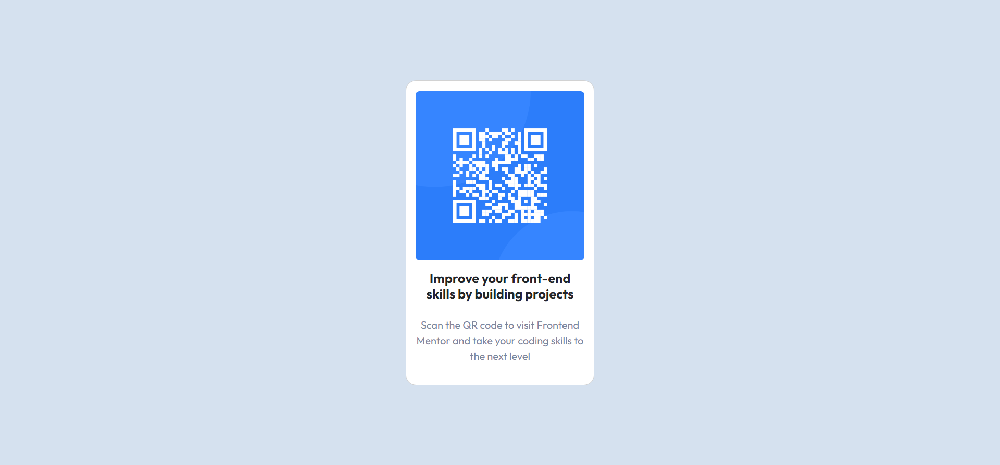

# Frontend Mentor - QR code component solution

This is a solution to the [QR code component challenge on Frontend Mentor](https://www.frontendmentor.io/challenges/qr-code-component-iux_sIO_H). Frontend Mentor challenges help you improve your coding skills by building realistic projects. 

## Table of contents

- [Overview](#overview)
  - [Screenshot](#screenshot)
  - [Links](#links)
- [My process](#my-process)
  - [Built with](#built-with)
  - [What I learned](#what-i-learned)
  - [Continued development](#continued-development)
- [Author](#author)
- [Acknowledgments](#acknowledgments)

## Overview

### Screenshot

### Links

- Live Site URL: [live site](https://doctorxeno-qr-code-component.netlify.app/)

## My process

### Built with

- Semantic HTML5 markup
- CSS custom properties
- Flexbox
- CSS Grid
- Mobile-first workflow
- [React](https://reactjs.org/) - JS library
- [Next.js](https://nextjs.org/) - React framework
- [Styled Components](https://styled-components.com/) - For styles

### What I learned

Being a beginner at front end development, I already knew many concepts that helped me throughout this challenge. One thing that I learnt particularly from this project is to adopt the mobile first approach as that makes our work a whole lot easier.

### Continued development

Use the movile first approach in more projects to make them stand-out. Also work with some more complex structures
## Author

- Website - [Rahul](https://www.linkedin.com/in/rahul-goel-815399229/)
- Frontend Mentor - [@RahulGoel2002](https://www.frontendmentor.io/profile/RahulGoel2002)

## Acknowledgments

A deep note of thanks to my mentor Angela Yu from the Udemy course The Complete 2023 Web Development Bootcamp. A deep note of thanks to my partner as well for supporting me in every aspect of my life.
